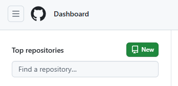
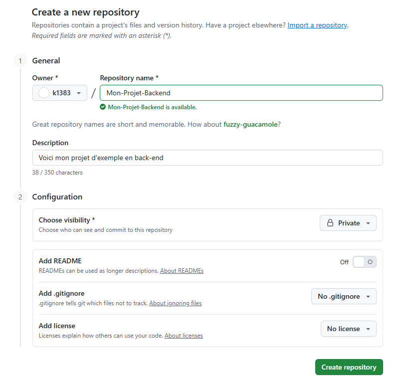
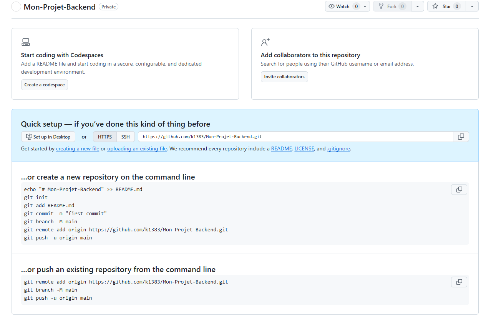
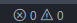
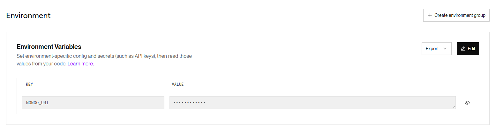

# Todo List
[](#) [](#)

## Table des matières
- [Description](#Description)
- [Objectif](#Objectif)
- [Installation](#Installation)
- [MongoDB](#MongoDB)
- [GitHub](#Github)
- [Déploiement](#Déploiement)

### Description
- **Todo List** est une application web permettant à un utilisateur de pouvoir créer une todo list 

### Objectif
- Créer une tâche
- Afficher toutes les tâches de l'utilisateur 
- Supprimer une une tâche 
- Cocher une tâche 
- Décocher une tâche 

### Installation
Node.js (version 22 ou supérieur)
npm 

#### Prérequis

1. Cloner le repository à partir de GitHub
- Cliquer sur "Code" et copier le lien 
- Sur votre bureau clic droit et ouvrir dans le Terminal, puis taper les commandes suivantes 
```bash
git clone https://github.com/k1383/Todo-List-back.git
cd Todo-List-back
```
2. Installer les dépendances
- Ouvrer votre projet sur sur VS Code et ouvrez le terminal
- Installation de mongoose `npm install mongoose`
- Installation de dotenv `npm install dotenv`

3. Lancer le back-end 
- Lancer le serveur `nodemon app.js`
L'application est disponible sur http://localhost:5173.

4. Créer un fichier à la racine de votre projet `.env` et ajouter 
```bash
    PORT=3000
    MONGO_URI=
```

### MongoDB

- Accèder au site de [MongoDB](https://www.mongodb.com/) pour créer une base de données 
-  Inscrivez-vous 
- Une fois sur la page d'accueil cliquez sur "New Project"
- Nommez votre projet et fait ensuite cliquer sur "next".
    - Si vous n'avez pas de membres à définir pour des autorisation cliquez sur "Create Project"
- Vous arrivez alors ici, cliquer sur "+ Create" 
 
- Une fois ici choisissez la versions gratuite et cliquez sur "Create Deployement"  

- Choisissez un nom d'utilisateur et un mot de passe :warning: **Stocker ces informations dans un endroit sécuriser**
    - Cliquer sur "Create Data User" et ensuite cliquer sur "choose a connection method" 

-  Ici sur "Connect to your application" cliquer sur "Drivers" 

- Vous arrivez sur "Connecting with MongoDB Driver"
    - Répcupérer le lien et faite un copier coller dans le fichier .env sur` MONGO_URI`
    - `MONGO_URI=lien`
    - :warning: attention a ne pas laisser d'espace

### GitHub
Sauvegarder sur GitHub
1. Accéder au site [GitHub](https://github.com/)
2. Inscrivez vous ou Connecter vous 
3. Une fois sur la page d'accueil cliquer sur "New" dans le tableau de bord

4. Nommez votre projet (si vous faite un reposiroy GitHub seulement pour le back, n'oubliez pas de le préciser), exemple : Mon-Projet-Backend
Vous avez le choix de mettre votre repository en Public ou Privé 
5. Cliquez sur (Create repository)

6. Nous arrivons sur cet page 

7. Aller sur votre vs code et ouvrez un terminal (crtl ù) ou pn clique sur
Renseigner les commande suivante :
```
    - git init 
    - git add * 
    - git commit -m "first commit"
    - git branch -M main
    - git remote add main (votre lien donner par GitHub)
    - git push -u origin main
```
Puis recharger la page sur GitHub (ctrl r) et votre projet sera sur GitHub.
Pour les prochain commit vous pourriez taper
``` 
    - git add *
    - git commit -m "votre message"
    - git push 
```

### Déploiement

Déploiement du Back-end sur Render  

[Documentation / aide](https://render.com/docs/web-services)

1. Cliquez sur le bouton **New** + du tableau de bord et sélectionner **Web Service**
2. Connectez votre dépôt GitHub ou GitLab ou entrez l’URL publique d’un dépôt public
3. Donnez un nom à votre site web
4. Language : Node
5. Branch : Main
6. Region : Frankfurt (la plus proche)
7. Build Commande : `npm install`
8. Start Command : `npm start`
9. Sur Render une fois le déploiement du back effectuer dans le tableau de bord cliquer sur "Project", cliquer ensuite sur votre déploiement back, toujours dans le tableau de bord cliquez sur "Environnement" et à présent créer une nouvelle variable d'environnement, dans la section "KEY" on renseigne "MONGO_URI" et dans la section "VALUE" on renseigne le même lien que dans le fichier .env récupèrer auparavant sur mongoDB

10. Cliquer sur "Project" dans le tableau de bord et cliquer sur votre déploiement front, vous avez un lien https://votre-projet-xxxxxx.com, cliquer dessus et vérifier que tous s'affiche correctement et tester si besoins 

- Repository GitHub du [Front-end](https://github.com/k1383/Todo-List-Front)