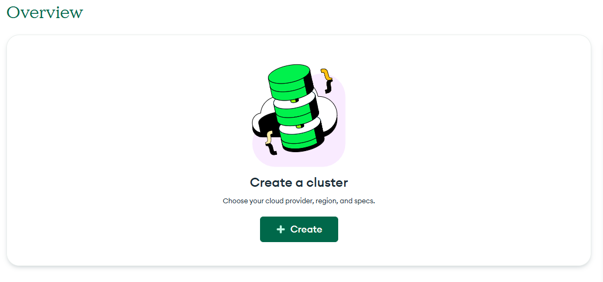
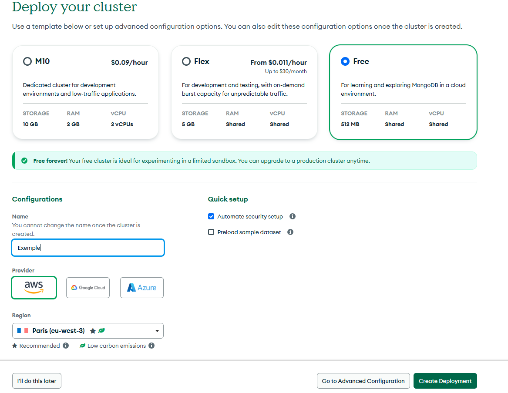
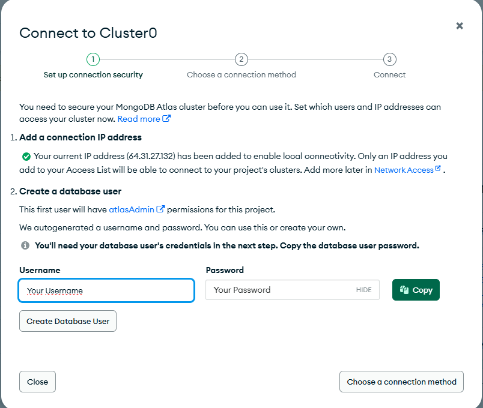
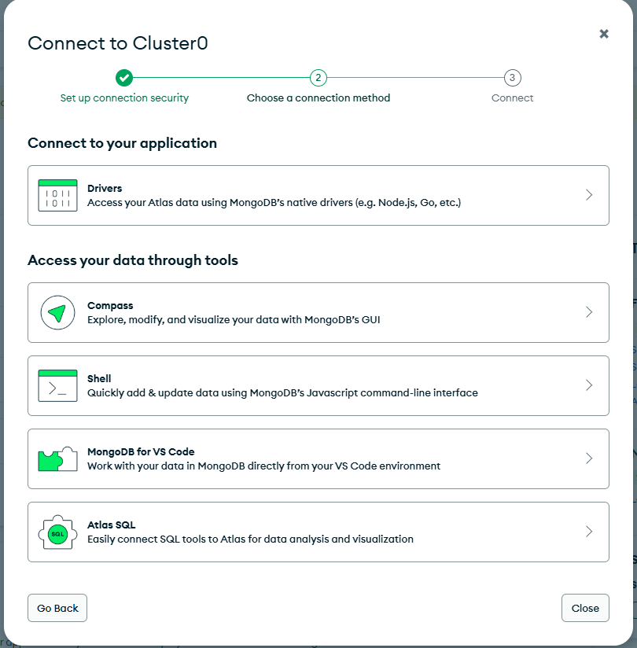

# Todo List
[](#) [](#)

## Table des matières
- [Description](#Description)
- [Objectif](#Objectif)
- [Installation](#Installation)
- [MongoDB](#MongoDB)
- [Aperçu](#Aperçu)
- [Déploiement](#Déploiement)

### Description
- **Todo List** est une application web permettant à un utilisateur de pouvoir créer une todo list 

### Objectif
Créer une tâche
Afficher toutes les tâches de l'utilisateur 
Supprimer une une tâche 
Cocher une tâche 
Décocher une tâche 

### Installation
Node.js (version 22 ou supérieur)
npm 

#### Prérequis

1. Cloner le repo
```bash
git clone https://github.com/k1383/Todo-List-back.git
cd Todo-List-back
```
2. Installer les dépendances
- Installation de mongoose `npm install mongoose`
- Installation de dotenv `npm install dotenv`

3. Lancer le back-end 
- Lancer le serveur `nodemon app.js`
L'application est disponible sur http://localhost:5173.

4. Créer un fichier `.env` et ajouter 
```bash
    PORT=3000
    MONGO_URI=
```


5. Créer un fichier `.gignore` et ajouter ceci
```bash
    .env
    node_modules
```

### MongoDB

- Accèder au site de [MongoDB](https://www.mongodb.com/)
-  Inscrivez-vous 
- Une fois sur la page d'accueil cliquez sur "New Project"
- Nommez votre projet et fait ensuite cliquer sur "next".
    - Si vous n'avez pas de membres à définir pour des autorisation cliquez sur "Create Project"
- Vous arrivez alors ici, cliquer sur "+ Create" 
 
- Une fois ici choisissez la versions gratuite et cliquez sur "Create Deployement"  

- Choisissez un nom d'utilisateur et un mot de passe :warning: **Stocker ces informations dans un endroit sécuriser**
    - Cliquer sur "Create Data User" et ensuite cliquer sur "choose a connection method" 

-  Ici sur "Connect to your application" cliquer sur "Drivers" 

- Vous arrivez sur "Connecting with MongoDB Driver"
    - Répcupérer le lien et faite un copier coller dans le fichier .env sur` MONGO_URI`
    - `MONGO_URI=lien`
    - :warning: attention a ne pas laisser d'espace

### Déploiement

Déploiement du Back-end sur Render  

[Documentation / aide](https://render.com/docs/web-services)

1. Cliquez sur le bouton **New** + du tableau de bord et sélectionner **Web Service**
2. Connectez votre dépôt GitHub ou GitLab ou entrez l’URL publique d’un dépôt public
3. Donnez un nom à votre site web
4. Language : Node
5. Branch : Main
6. Region : Frankfurt (la plus proche)
7. Build Commande : `npm install`

8. Ajouter  `"start": "node app.js"` dans le package.json dans `scripts` et vérifier avec npm start dans le terminal puis faite un commit

9. Start Command : `npm start`

- Repository GitHub du [Front-end](https://github.com/k1383/Todo-List-Front)