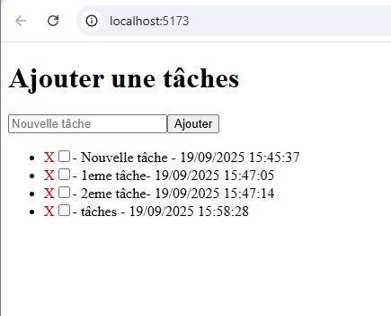

# Todo List
[](#) [](#)

## Table des matières
- [Description](#Description)
- [Objectif](#Objectif)
- [Installation](#Installation)
- [Aperçu](#Aperçu)

### Description
- **Todo List** est une application web permettant à un utilisateur de pouvoir créer une todo list 

### Objectif
Créer une todo list
Afficher toutes les todo list de l'utilisateur 
Mettre à jour une todo list
Supprimer une todo list

### Installation
Node.js (version 22 ou supérieur)
npm 

#### Prérequis

1. Cloner le repo
```bash
git clone https://github.com/k1383/Todo-List-back.git
cd Todo-List-back
```
2. Installer les dépendances
- Installation de mongoose `npm install mongoose`
- Installation de dotenv `npm install dotenv`

3. Lancer le back-end 
- Lancer le serveur `nodemon app.js`
L'application est disponible sur http://localhost:5173.

### Fonctionnalités principales

### Aperçu
Aperçu d'une todo list d'un utilisateur 
Nous pouvons ajouter une nouvelle tâche grâce formulaire, cocher une tâche si celci est terminer ou bien la décocher et ainsi on peux supprimer une tâche en cliquant sur la croix rouge  


# Gestionnaire de Tâches (To-Do List)
*   **Concept :** L'application web la plus classique pour débuter.
*   **Données :** Tâche (id, texte, estComplétée).
*   **Opérations CRUD :**
    * `CREATE` : Ajouter une nouvelle tâche.
    * `READ` : Afficher toutes les tâches.
    * `UPDATE` : Marquer une tâche comme "complétée".
    * `DELETE` : Supprimer une tâche.

## Les endpoints 

GET     /todo       -- Pour récupérer tous les éléments de liste
GET     /todo/:id   -- Récupérer un élément de liste en particulier
POST    /todo       -- Créer un élément de list
PATCH   /todo/:id   -- Modifier un élément de liste pour le passer à !isCompleted  
DELETE  /todo/:id   -- Supprimer un élément de liste 

## Schema de données 

- Id : Identifiant unique de l'élément de liste (string)
- Title : Contenu textuel de l'élément de liste (string, require)
- isCompleted : Est-ce que l'élément de liste est complété ? (Boolean, require)
- creationDate : Quand l'élément de liste à été créer (Date, require)
- completeDate : Quand l'élément à été marqué comme validé (Data)
